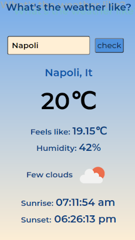

# React Weather App

This web page is a simple portifolio made with Reactjs for training.

 

### Web deploy:

https://whatistheweatherlike.netlify.app/

 

>Mobile Version

 

>Desktop Version

 
 
 

In the project directory, you can run:

### `npm start`

Runs the app in the development mode.\
Open [http://localhost:3000](http://localhost:3000) to view it in the browser.

The page will reload if you make edits.\
You will also see any lint errors in the console.

## Learn More

To learn React, check out the [React documentation](https://reactjs.org/).
