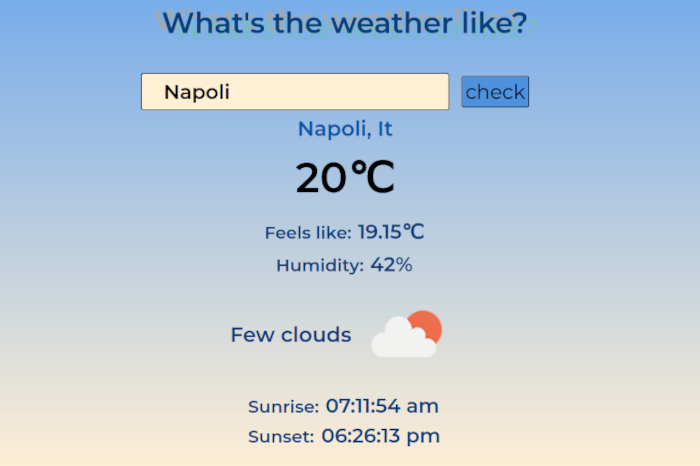

# React Weather App

This webpage is a simple project to check the weather forecast and was created with ReactJS for training purposes.

 

### Web deploy:

https://whatistheweatherlike.netlify.app/

 

> Mobile Version

 

> Desktop Version

 
 
 

In the project directory, you can run:

#### `npm start`

Runs the app in the development mode.\
Open [http://localhost:3000](http://localhost:3000) to view it in the browser.

The page will reload if you make edits.\
You will also see any lint errors in the console.
 
 
 
 

## API Used

[Open Weather Map](https://openweathermap.org/api)

 
 

## Library Used

[Moment.js](https://momentjs.com/), a JavaScript date library for parsing, validating, manipulating and formatting dates.

 
 

## Graphic Extension Used

[SASS](https://sass-lang.com/)
Sass is a preprocessor scripting language that is interpreted or compiled into Cascading Style Sheets (CSS). SassScript is the scripting language itself.

 
 

## Learn More About ReactJS:

Check out the React documentation on the [Official Website](https://reactjs.org/).
